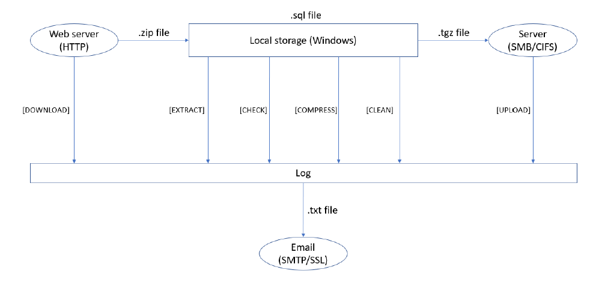
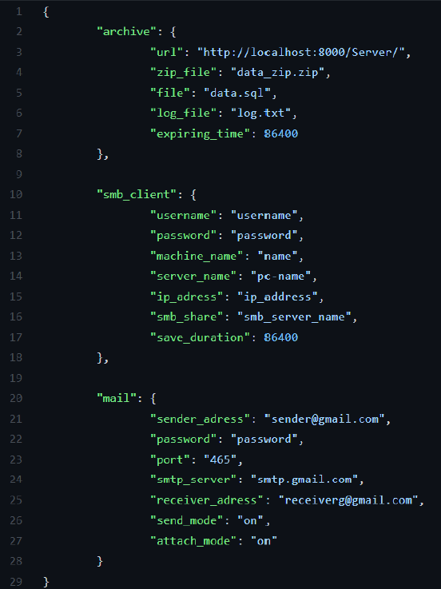
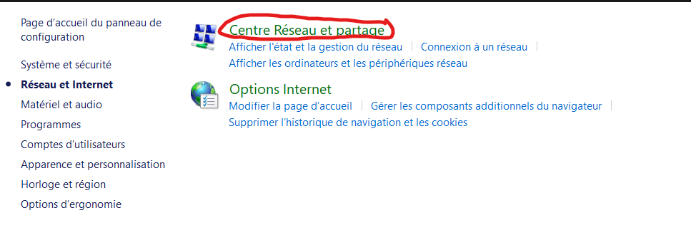
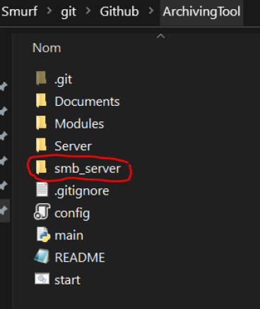
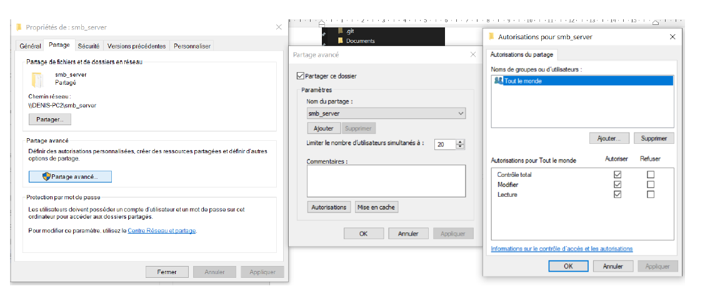
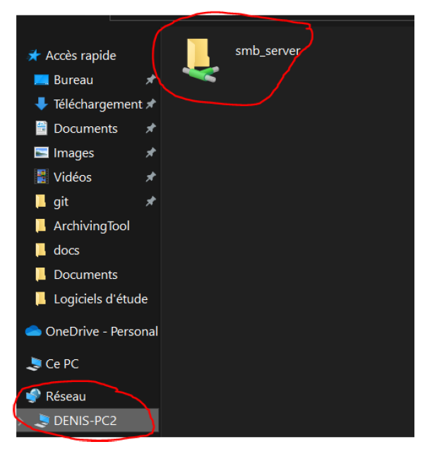
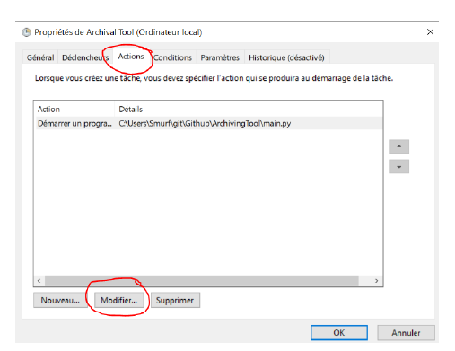
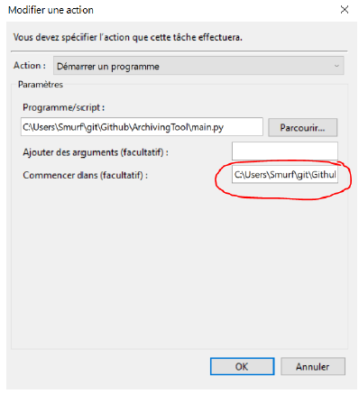
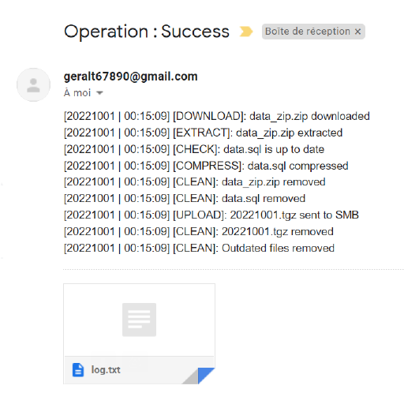

# ArchivingTool - LEANG Denis

<!-- TABLE OF CONTENTS -->
<details>
  <summary>Table of Contents</summary>
  <ol>
    <li>
      <a href="#about-the-project">About The Project</a>
      <ul>
        <li><a href="#built-with">Built With</a></li>
        <li><a href="#more-details">More details</a></li>
      </ul>
    </li>
    <li>
      <a href="#getting-started">Getting Started</a>
      <ul>
        <li><a href="#prerequisites">Prerequisites</a></li>
        <li><a href="#installation">Installation</a></li>
      </ul>
    </li>
    <li><a href="#usage">Usage</a>
      <ul>
        <li><a href="#how-to-json">A. How to configure the json file</a></li>
        <li><a href="#how-to-smb">B. How to create the SMB share server</a></li>
        <li><a href="#how-to-run">C. How to run the program periodically</a></li>
      </ul>
    </li>
    <li><a href="#contact">Contact</a></li>
  </ol>
</details>

<!-- ABOUT THE PROJECT -->
## About The Project

This project is a simple archiving tool built with Python. This tool allows a user to do these successive actions periodically:

1. Download a zip file from a web server (HTTP)
2. Extract that zip file
3. Check whether its content is up to date and valid
4. Compress it after validation into a tgz file
5. Send the tgz file to a server (SMB/CIFS)
6. (Optional) Send an email stating if operation succeeded or not

A logfile stores useful information throughout the whole operations to check if everything works properly or not. It can be attached to the email if the user chooses to do so.

Here is a drawing to better understand the whole process : 



### Built With

* [pylint](https://pypi.org/project/pylint/)
* [requests](https://pypi.org/project/requests/)
* [pysmb](https://pysmb.readthedocs.io/en/latest/)

### More details

You can check the folder "Documents" for more details on how the code is written and how to actually use the tool. 
This tool is mainly aimed at Windows workstations. Therefore, it may not work for MacOS or Linux users.

<p align="right">(<a href="#top">back to top</a>)</p>

<!-- GETTING STARTED -->
## Getting Started

### Prerequisites

Clone the repository with SSH or HTTPS
   ```sh
   git clone git@github.com:YeriAddict/ArchivingTool.git
   ```
   ```sh
   git clone https://github.com/YeriAddict/ArchivingTool.git
   ```

### Installation

You will need to install these external libraries using pip. 
  ```sh
  py -m pip install pysmb 
  py -m pip install requests
  ```
  
<p align="right">(<a href="#top">back to top</a>)</p>

<!-- USAGE EXAMPLES -->
## Usage

You will need to complete these steps in order to successfully launch the tool. At the end, the task will be done periodically.

### A. How to configure the json file

To begin with, you will have to configure the config.json file cautiously. Here is a screenshot of what the file looks like : 



The names of the json objects are conveniently named after the classes in the code. But all you must worry about as a user are the following elements. Changing the values in which “NO CHANGE” is specified is not advised:

➢ archive:  
  ▪ “url”: NO CHANGE  
  ▪ “zip_file”: NO CHANGE  
  ▪ “file”: NO CHANGE  
  ▪ “log_file”: Name of the generated log file  
  ▪ “expiring_time”: Duration (in seconds) after which a file is considered outdated  
  
➢ smb_client:  
  ▪ “username”: Current windows session username  
  ▪ “password”: Current windows session password  
  ▪ “machine_name”: Whatever name you want to enter  
  ▪ “server_name”: Name of the current PC  
  ▪ “ip_address”: IP address  
  ▪ “smb_share”: Name of the shared samba server (see after)  
  ▪ “save_duration”: Duration (in seconds) after which a file will be deleted in the smb server depending on its last modification date  
  
➢ archive:  
  ▪ “sender_address”: An E-mail address for the expeditor (Note: Gmail is advised)  
  ▪ “password”: Password for the address above  
  ▪ “port”: NO CHANGE  
  ▪ “smtp_server”: NO CHANGE  
  ▪ “receiver_address”: An E-mail address for the receiver (Note: Gmail is advised)  
  ▪ “send_mode”: Put on or off depending on if you want to receive mails  
  ▪ “attach_mode”: Put on or off depending on if you want to have logs attached in the mails  

If you struggle finding how to fill "ip_address", follow these steps : 
1. Type *ipconfig* inside a terminal window
2. Get the correct IP address in front of IPv4

Finally, for the "sender_address", you should use a Gmail address. Having a throwaway Gmail address for the sender is advised for security reasons because you will have to enter login credentials inside the config.json to start the script. You must activate this mode: “Allow less secure apps” to on in Gmail. It is essential if you wish to receive the E-mails from the sender address as a receiver. To find this mode, go to :

➢ Settings → Security → Access to less secure apps  

### B. How to create the SMB share server

To setup the SMB share server, follow these steps :

1. Network activation

Ensure that you have Network activated on your Windows workstation. It is normally activated by default. If not, follow these steps :

a. Go to control panel and click on *Network and Internet*


b. Go to *Network and Sharing Center*



c. Finally in *Advanced sharing options*, check everything


2. Folder creation

You will then have to create a folder in the root of the code’s folder like this :



It is mandatory to create that folder here for the code to work properly so do not place it anywhere else.
Then, activate those settings by right clicking the folder to setup the SMB server :



If everything went smoothly, you should now see this on your Windows explorer :



The SMB share is now ready to use.

### C. How to run the program periodically

Everything should now be ready for the code to work. If you run *server.py* and *main.py* (in that order) on any IDE, the script will work. In our case, we want it to be automatic. To do so you need to follow these steps.

1. Batch file

You should see a start.bat file inside the folder.
You must change the path to match with your folder’s path inside the batch file. It is also possible for you to change the frequency at which main.py is executed. For more information on how to do so, you can go to this link [Schtasks](https://learn.microsoft.com/en-us/previous-versions/orphan-topics/ws.10/cc772785(v=ws.10)?redirectedfrom=MSDN).
When everything is changed, you can now run *start.bat* by double clicking it.

2. Windows Task Scheduler

You now must add path for the script to work in Task Scheduler.

a. Go to Task Scheduler, right click “Archiving Tool” and Properties:

b. Click on Actions and Modify



c. Add the path to your project’s root folder inside this:



Note that *server.py* will run indefinitely until the workstation is shut down. So, beware to click again on *start.bat* if you close your computer at some point else the script will run but fail with the operations. You do not need to modify the task which runs main.py whatsoever so just type “N” if prompted to.


Everything is now ready and set to work properly. You can thus enjoy storing files with this Archiving Tool.



<p align="right">(<a href="#top">back to top</a>)</p>

<!-- CONTACT -->
## Contact

LEANG Denis - denis.leang@telecom-st-etienne.fr 

Link: [https://github.com/YeriAddict/ArchivingTool](https://github.com/YeriAddict/ArchivingTool)

<p align="right">(<a href="#top">back to top</a>)</p>
